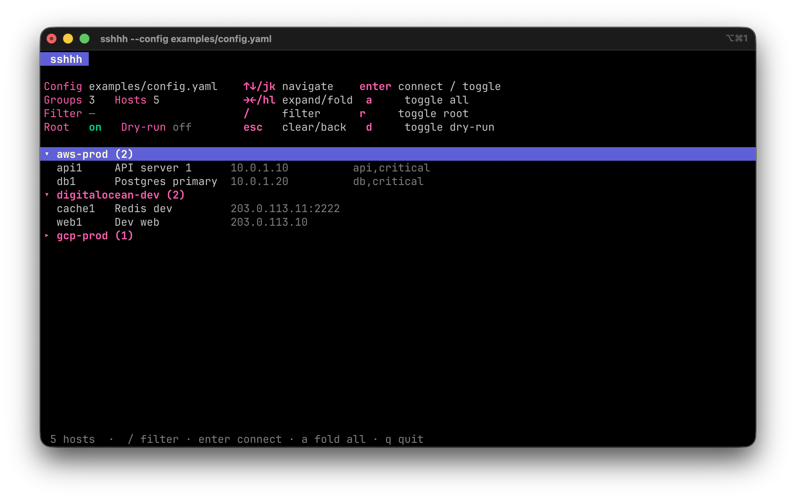

[](https://github.com/alexandrfiner/sshhh/releases)
[](LICENSE)
[](https://github.com/alexandrfiner/sshhh/releases)

# sshhh

A quiet ssh launcher: pick a host by name / group / tag with fuzzy search and
connect. Don't remember the alias — just type part of the name or group.

`sshhh` is a resolver + launcher: it builds the arguments and calls the system
`ssh`, so you inherit the ssh-agent, `known_hosts` and `ProxyJump` for free.

## Install

```sh
go install github.com/alexandrfiner/sshhh@latest
```

Or build from a checkout:

```sh
go build -o sshhh .
sudo mv sshhh /usr/local/bin/      # or any directory on $PATH
```

Optional short shell alias so you don't type 5 letters:

```sh
echo "alias s=sshhh" >> ~/.zshrc && source ~/.zshrc
```

## Screenshots



## Config

Defaults to `~/.config/sshhh/config.yaml` (override with `$SSHHH_CONFIG` or the
`--config` flag). See [`examples/config.yaml`](examples/config.yaml).

```yaml
defaults:                 # global defaults
  user: alex
  identity: ~/.ssh/id_rsa

groups:
  aws-prod:
    defaults:             # group defaults (override global)
      jump: bastion-aws
      user: ubuntu
    hosts:
      db1:
        host: 10.0.1.20
        name: Postgres primary
        desc: replicas db2/db3
        tags: [db, critical]
        sudo: true        # log in as root (sudo -i)
      api1:
        host: 10.0.1.10
        name: API server 1
```

Inheritance: **global → group → host**, each level overrides only the fields it
sets. A group is just a top-level key (`aws-prod`, `digitalocean-dev`, …),
handy for slicing by provider/environment.

## Usage

```sh
sshhh                    # open the browser across all hosts → connect
sshhh db1                # connect directly by alias (unambiguous → no browser)
sshhh aws-prod/api1      # qualify the group when an alias repeats
sshhh prod               # single match → connect; several → browser seeded with "prod"
sshhh ls                 # plain list of hosts by group

sshhh -r db1             # request a TTY and run sudo -i
sshhh -n db1             # dry-run: print the ssh command without running it
```

## The browser (k9s-style TUI)

With no unambiguous match, `sshhh` opens a full-screen browser: a header with
config/context and keybindings, a collapsible tree of groups (each header shows
`▸`/`▾` and a host count), and a live filter. The filter matches over `group
alias name tags`, so `prod` narrows to all prod hosts and `db` to everything
named/tagged db, auto-expanding the groups that match.

```
▸ aws-prod (12)
▾ digitalocean-dev (3)
  web1    Dev web            203.0.113.10       web
  cache1  Redis dev          203.0.113.11:2222  cache
```

| Key               | Action                                                   |
|-------------------|----------------------------------------------------------|
| `↑` `↓` / `j` `k` | move selection                                           |
| `→` `←` / `l` `h` | expand / collapse the current group                      |
| `enter`           | on a group: expand/collapse · on a host: connect         |
| `a`               | expand or collapse all groups                            |
| `/`               | filter (type to narrow; `↑`/`↓` still navigate)          |
| `esc`             | clear the filter, or quit if none                        |
| `r`               | toggle `sudo -i` on connect                              |
| `d`               | toggle dry-run (print the command instead of connecting) |
| `q` / `ctrl+c`    | quit without connecting                                  |

## Flags

| Flag              | Description                                |
|-------------------|--------------------------------------------|
| `-r`, `--root`    | request a TTY and run `sudo -i` on login   |
| `-n`, `--dry-run` | print the `ssh` command without running it |
| `--config PATH`   | path to config                             |
| `-h`, `--help`    | help                                       |

## Roadmap

- `sshhh gen` — project the config into `~/.ssh/config.d/sshhh.generated`
  (Include), so `scp` / `rsync` / VSCode Remote-SSH know the same hosts.
- Proxmox provider — dynamic IP/port resolution for VMs via the API.
```
